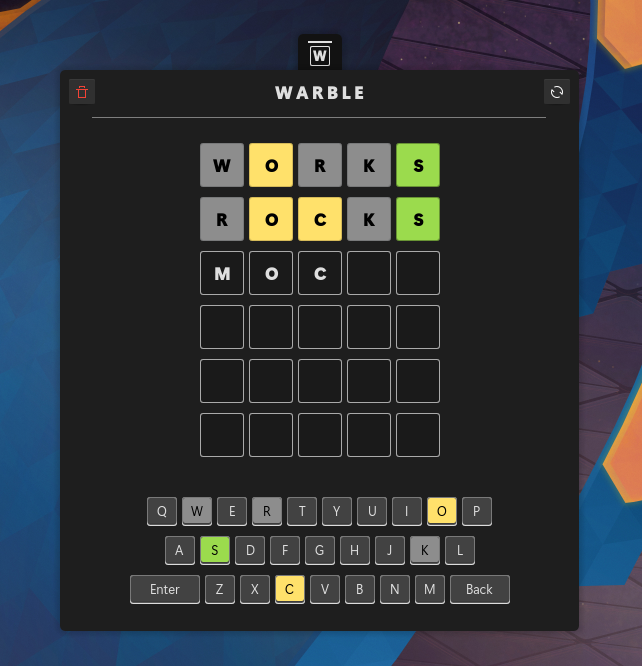
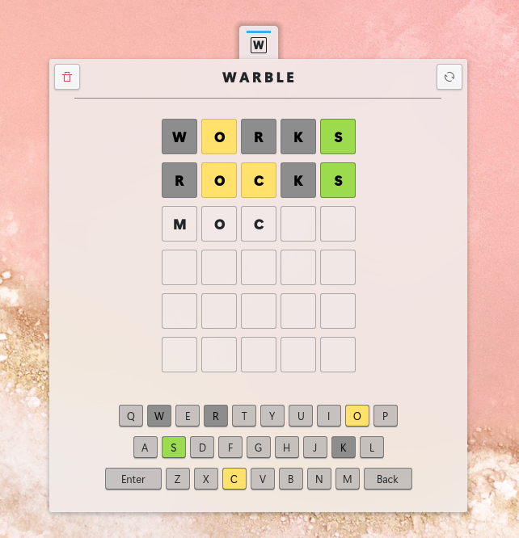

<h1 align="center">Warble plasmoid for Plasma KDE</h1>
<h5 align="center">Based on <a href="https://github.com/avojak/warble"> Warble </a>  of **Andrew Vojak** </h5>

|  |  |  |
|------------------------------------------------------------------|------------------------------------------------------------------|------------------------------------------------------------------|

## The word-guessing game [Disclaimer]

Warble is a plasmoid extension word-guessing game built in Qml for KDE.

"
Please read https://github.com/avojak/warble

Figure out the word before your guesses run out!
- Three difficulty levels
- Almost 5k possible answers
- [In progress] Need a break? Close the game and automatically pick back up where you left off

Warble is inspired by (and not affiliated with) the recently popular online game Wordle (which itself is reminiscent of the late 80's game show Lingo). 

"

## Install 

Install from Kde Store .... [soon a link]

## Word List

The `dictionary.txt` word list is sourced from [sindresorhus/word-list](https://github.com/sindresorhus/word-list).

## Todo

- Statistics
- Translations
- Add keyboard layouts and languages

## Coffee

Share your ❤️ Buy me a ☕

